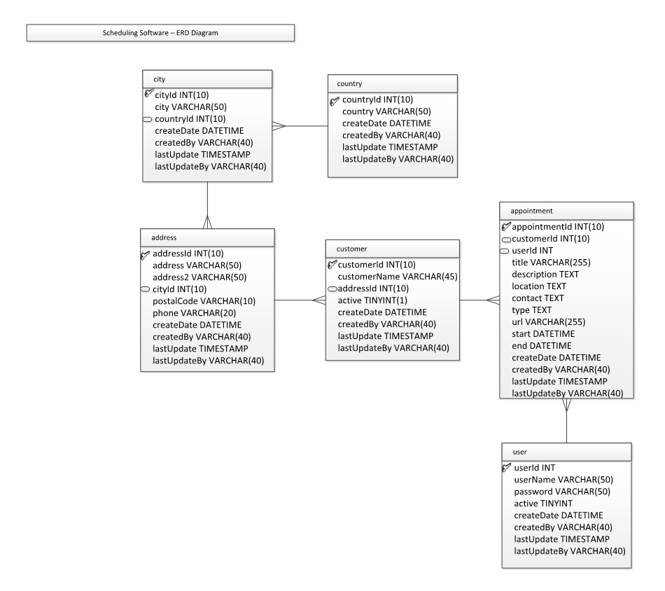

#  Western Governors University C195 Software II Project

This is a Java scheduling app where a user can login and create appointments and customers, assign customers to
appointments, view all customers and all appointments and each of their individual information and inactivate customers. 

The project has a connection string for a mySQL database that matches the following ERD: 

The connection string is found in the DBConnection.java file, it was made to connect to a premade database that was 
ready made for the project. It could be switched out and the code could be made to work with any mySQL database that 
matches the above ERD. 
